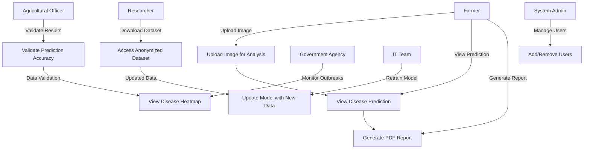

Explanation
Actors
Farmer: Primary user who interacts with disease prediction and recommendations.

Agricultural Expert: Validates predictions and updates the disease database.

System Admin: Manages user accounts and generates reports.

Relationships
Process Image via CNN is included in View Disease Prediction.

Notify Expert if Critical extends View Disease Prediction for urgent cases.

Stakeholder Alignment
Ensures real-time disease detection aligns with farmers' needs.

Supports experts in maintaining accurate disease data.
